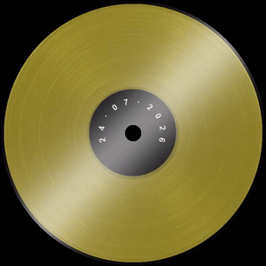
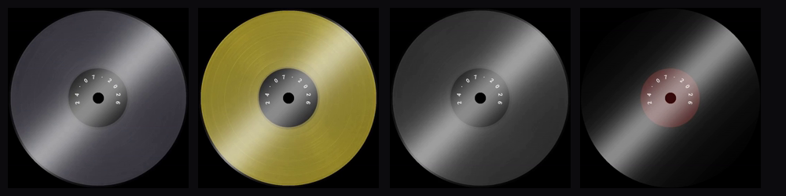

<h1 align="center">🎵 VinilCut</h1>

<p align="center">
  <b>Cover + audio → a spinning-vinyl video.</b><br>
  A tiny Rust web app that turns any track into a rotating record —<br>
  and squares it into a <b>Telegram round message</b> (кружок) you can send as yourself.
</p>

<p align="center">
  
  
  
  
  
</p>

<p align="center">
  
</p>

---

## ✨ Features

- 🎧 **Audio → video** — drop a track, get a spinning record. Length matches the audio.
- 🖼️ **Cover in the center** — your artwork becomes the label. No cover? A clean date label is generated.
- ⭕ **Telegram round message** — a 512×512, ≤60 s square mode, ready to send as a *video note* (кружок).
- 🎨 **Any color** — a real vinyl texture recolored on the fly (pick vinyl color **and** label color).
- 💡 **Fixed reflection** — a static light band the disc spins *under* (the glare stays put — like real window light).
- 🕳️ **Real details** — genuine grooves & imperfections, "between-song" gaps, a center hole in the label color.
- 📊 **Live progress** — real FFmpeg render % streamed to the browser.
- 🚫 **No cloud, no accounts** — everything runs locally.

## 🎨 One texture, any color

The disc is a real record captured **once** as a grayscale groove map, then tinted to whatever you choose:

<p align="center">
  
</p>

## 🚀 Quick start

**Requirements:** [Rust](https://rustup.rs) and [FFmpeg](https://ffmpeg.org/download.html) on your `PATH`.

```bash
git clone https://github.com/gravitymir/vinil_cut.git
cd vinil_cut
cargo run --release
```

Open **http://localhost:3400**, pick an audio file (cover optional), choose colors, hit **Render vinyl**, then preview / download the `.mp4`.

> Run it from the project folder — it reads `assets/disc_base.png` by a relative path.

## ⭕ Send a Telegram video note (кружок)

A round video message is a special message type — you can't make one from a normal upload. Send the square (≤60 s) mp4 through a *client* API, so the circle appears as sent by **you**. Two interchangeable senders are included; both take `TG_API_ID` / `TG_API_HASH` from [my.telegram.org](https://my.telegram.org) → *API development tools*, and both ask for your phone + login code on first run (creating `vinilcut.session`).

### Native Rust (grammers) — `send-note/`
```bash
cd send-note
setx TG_API_ID 123456   &&  setx TG_API_HASH 0123...   # once, then open a NEW terminal
cargo run --release -- ..\path\to\vinyl.mp4            # -> Saved Messages
cargo run --release -- vinyl.mp4 @channel              # -> a chat/channel/username
```
It re-encodes any input to a valid note (square, ≤60 s) before sending. No Python needed.

### Python (Telethon) — `scripts/send_note.py`
```bash
pip install telethon
python scripts/send_note.py vinyl.mp4 [@target]
```

## 🛠 How it works

```
audio ──┐
        ├─►  ffmpeg filtergraph  ──►  spinning-vinyl mp4
cover ──┘     • disc  = grayscale groove map (assets/disc_base.png) tinted to the chosen color
              • label = your cover / date on a colored sticker, with a center hole
              • shine = a separate STATIC layer overlaid after rotation (glare doesn't spin)
              • note  = square 512×512, capped at 60 s for Telegram round messages
```

- **Recoloring** multiplies the gray groove map by the chosen color (`out = color × gray / 140`), so the real grooves survive every tint. Results are cached per color under `work/`.
- **The shine never rotates** — only the disc is rotated, then the light band is composited on top, so the reflection stays fixed while the record turns beneath it.

## ⚙️ Customize (`src/main.rs`)

- **Swap the disc look** — replace `assets/disc_base.png` with any grayscale, circle-masked record.
- **Spin speed** — `rotate=a='2*PI*t/3'` (period in seconds).
- **Shine** — width / brightness / angle live in `SHINE_FILTER`.
- **Note size & cap** — `512` in the `GRAPH_NOTE_*` graphs and `-t 60`.
- **Port** — `PORT` (default `3400`).

## 📄 License

MIT — see [LICENSE](LICENSE).
